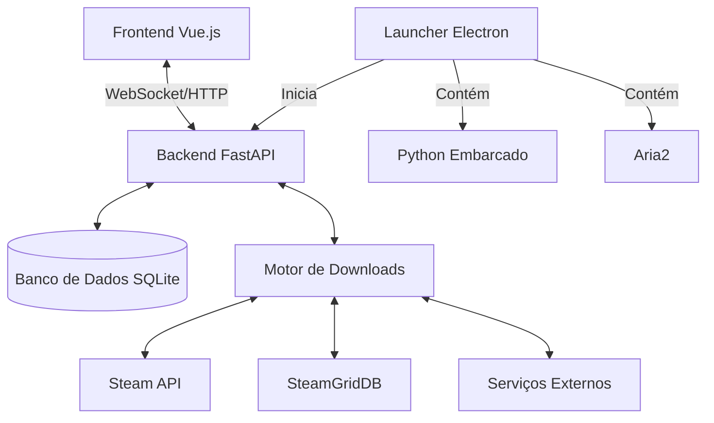

# Visão Geral da Arquitetura

## Diagrama de Alto Nível

## Componentes Principais

### 1. Frontend (Vue.js 3 + Vite)
- **Tecnologias**: Vue 3, Pinia (gerenciamento de estado), Vue Router, TailwindCSS
- **Características**:
  - Interface reativa e responsiva
  - Atualizações em tempo real via WebSocket
  - Componentes modulares e reutilizáveis
  - Suporte a temas (claro/escudo)

### 2. Backend (FastAPI + SQLModel)
- **Tecnologias**: Python 3.10+, FastAPI, SQLModel, SQLAlchemy, Pydantic
- **Características**:
  - API RESTful com documentação automática (Swagger/OpenAPI)
  - WebSockets para atualizações em tempo real
  - Validação de dados com Pydantic
  - ORM moderno com SQLModel (combina SQLAlchemy + Pydantic)

### 3. Banco de Dados
- **Tecnologia**: SQLite
- **Estrutura**:
  - Tabelas principais: `sources`, `items`, `jobs`, `job_parts`, `favorites`
  - Migrações manuais (sem sistema de migração automática atualmente)

### 4. Motor de Downloads
- **Tecnologias**: Aria2 (C++), Python (wrapper)
- **Funcionalidades**:
  - Gerenciamento de filas de download
  - Suporte a múltiplas conexões
  - Pausa/continuação de downloads
  - Suporte a HTTP/HTTPS, Magnet, Torrent

### 5. Integração com Steam
- **APIs**: Steam Web API, SteamGridDB API
- **Funcionalidades**:
  - Busca de jogos na biblioteca Steam
  - Download de metadados (imagens, descrições)
  - Cache local de imagens

### 6. Serviço de Análise (New!)
- **Responsabilidade**: Comparar saúde de torrents antes do download.
- **Funcionalidades**:
  - **Live Probe**: Consulta UDP a até 40 rastreadores em tempo real.
  - **Heurística**: Normalização de nomes para encontrar equivalentes.
  - **Sanidade**: Filtro automático de dados falsos (seeds > 500k).

## Fluxo de Dados

1. **Inicialização**:
   - O Launcher inicia o backend FastAPI
   - O frontend se conecta via WebSocket
   - Dados iniciais são carregados (fontes, downloads ativos, favoritos)

2. **Adição de Nova Fonte**:
   - Usuário adiciona uma URL de fonte JSON
   - Backend valida e processa o JSON
   - Itens são armazenados no banco de dados
   - Frontend é notificado via WebSocket

3. **Início de Download**:
   - Usuário inicia um download
   - Backend cria um job no banco de dados
   - Motor de downloads é acionado
   - Progresso é enviado via WebSocket

4. **Atualização em Tempo Real**:
   - O motor de downloads atualiza o progresso
   - Backend propaga via WebSocket
   - Frontend atualiza a UI em tempo real

## Decisões de Design

1. **Arquitetura Híbrida**:
   - Combina SPA (Single Page Application) com backend API
   - Permite desenvolvimento e teste independentes
   - Facilita futuras migrações de frontend/backend

2. **Banco de Dados SQLite**:
   - Escolhido por simplicidade e portabilidade
   - Não requer servidor de banco de dados separado
   - Fácil backup (apenas copiar o arquivo)

3. **WebSockets para Atualizações em Tempo Real**:
   - Melhor experiência do usuário
   - Reduz chamadas HTTP desnecessárias
   - Sincronização em tempo real entre abas/dispositivos

4. **Contêinerização de Dependências**:
   - Python e Aria2 incluídos como binários portáteis
   - Sem necessidade de instalação no sistema
   - Facilita a distribuição

## Limitações Conhecidas

1. **Escalabilidade**:
   - SQLite pode ter problemas com alta concorrência
   - Não projetado para múltiplos usuários simultâneos

2. **Segurança**:
   - Autenticação/autorização básicas
   - Sem suporte a múltiplos usuários

3. **Performance**:
   - Processamento de JSON grandes pode ser lento
   - Interface pode travar com muitas atualizações simultâneas

## Próximos Passos

1. Implementar sistema de plugins
2. Adicionar suporte a mais fontes de metadados
3. Melhorar sistema de cache
4. Adicionar suporte a múltiplos usuários
